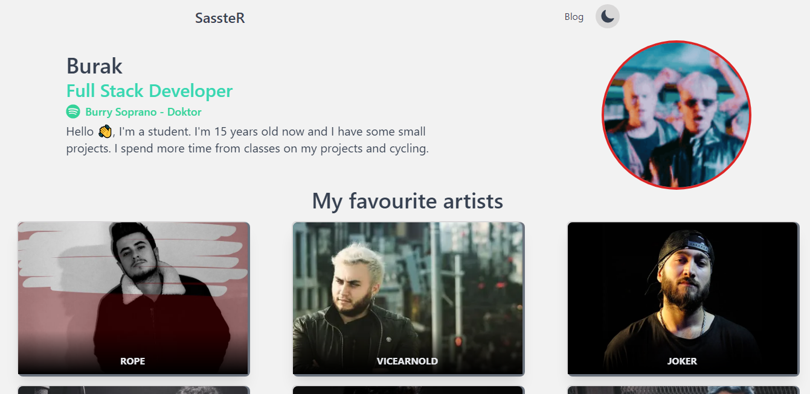
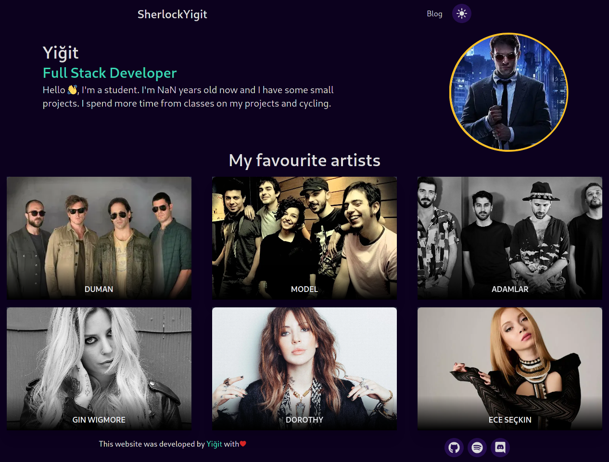

# Website - Portfolio/Blog
[React](https://reactjs.org/), [Next.js](https://nextjs.org/), [Framer
motion](https://framermotion.com/api/motion/examples) and
[TailwindCSS](https://tailwindcss.com/docs) were used in the development of this project. 

## Demo images
### Light mode

### Dark mode

